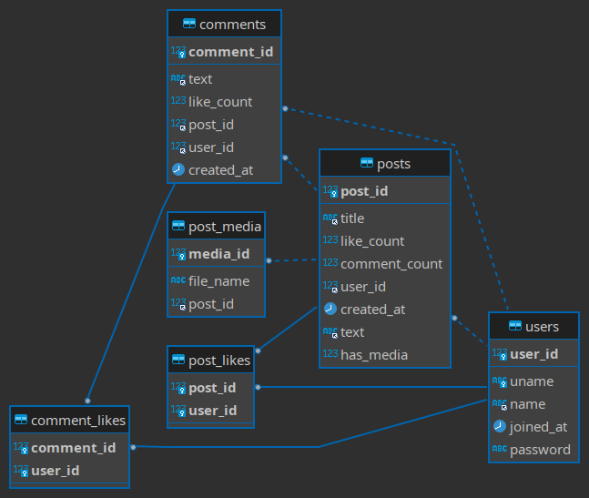

# Discussion Service

## Overview
This backend of this service is a REST api which routes using which a user can perform following tasks: 
 1. Post on the discussion forum, with a post having text and images.
 2. Search for a post using its title, author, and text.
 3. Comment on and “like" the post. They may also “like" comments.

The general flow goes something like this: 
 1. User registers by giving a `username`, `name` and `password`
 2. User logs in using `username` and `password` which returns **jwt token** , which further gets used to authenticate that particular user.
 3. User will use this **token** to perform obove mentioned actions.

## Tech Stack 
 - **Backend** - Python ([FastAPI](https://fastapi.tiangolo.com/)) 
 - **Database** - MySQL

## Database Structure
The database contains the following tables:

 1. **`users`**  - Stores users account details
	 - `user_id`: **Primary Key (PK)** for users table.
	 - `uname`: Username of a person (Unique)
	 - `name`: Name of a person
	 - `joined_at`: Timestamp at which the used registered
	 - `password`: **Bcrypt hash** of the actual password.
	 
2.  **`posts`** - Stores post details
	- `post_id`: **PK** for posts table.
	- `title`: Title of the post
	- `like_count`:  Count of the number of likes on the post 
	- `comment_count`: Count of the number of comments on the post
	- `user_id`: **Foreign Key (FK)** of `users.user_id` . It is the `user_id` of the person who created this post.
	- `created_at`: Timestamp at which this post was created.
	- `text`:  The body of the post
	- `has_media`: Boolean value to determine whether this post has a media file (images).
	
3. **`comments`** - Stores all the comments on a post.
	- `comment_id`: **PK** for a comment
	- `text`: The content of a comment
	- `like_count`: Count of the number of likes on the comment
	- `user_id`: **FK** of `users.user_id`. It is the `user_id` of the person who created added this comment.
	- `post_id`: **FK** of `posts.post_id`. It is the `post_id` of the post on which the comment was added.
	- `created_at`: Timestamp of when this comment was added.

4. **`post_media`** - Stores the filename of media files attached on a post.
	- `media_id`: **PK** for a media record.
	- `file_name`: This stores the filename by which a media file is uploaded on the CDN. This name gets appended to the **base URL** of the CDN to get the fully resolvable link.
	- `post_id`: **FK** of `posts.post_id`. It is the `post_id` of the post on which this media file is attached to.

5. **`post_likes`** - Store the `id`s of posts and the person who liked it.
	- `post_id`: **FK** of `posts.post_id`. i.e. What post ?
	- `user_id`: **FK** of `users.user_id`. i.e. Who liked it ?
**NOTE**: Here both `post_id` and `user_id` together make the **Primary Key**  of this table.

6. **`comment_likes`** - Store the `id`s of comments and the person who liked it.
	- `comment_id`: **FK** of `comment.comment_id`. i.e. What comment ?
	- `user_id`: **FK** of `users.user_id`. i.e. Who liked it ?
	**NOTE**: Here both `comment_id` and `user_id` together make the **Primary Key**  of this table.

Following is the **Entity-Relationship** diagram of the Database.



## Api Routes:
1.  **POST**  `/register` : Takes the user info, checks whether username is available or not. If it is available, hashes the password and save the information to `users` table.
		**Body**: 
		
		{
			"uname": <username of the person>,
			"password": <strong password>,
			"name": <name of the person>
		}
2. **POST** `/login`: Takes username and password. Checks whether password matches using inbuilt hash matching function of bcrypt library. Returns a signed **JWT** token.
		**Body**:
	```
	{
		 "uname": <username of the person>,
		 "password": <password related to this account>
	}
	```
3. **POST** `/add-post`: Authenticates user based on jwt token. Uploades the image to Amazon S3 Bucket if it is available. Saves the filename and post data to their relevant tables.
		**Header**: 
			- `token`:  jwt token returned after logging in
		**Form Data** : 
			- `title`: title of the post
			- `text`: body of the post (Optional)
			- `image`: image file (Optional)
		
4. **POST** `/add-comment`: Authenticates user based on jwt token. Saves the comment data on relevant tables.
		**Header**: 
			- `token`:  jwt token returned after logging in
		**Body** : 
		
		{
			"text": <body of the comment>,
			"post_id": <id of the post on which the comment was added>
		}
		

5. **POST** `/toggle-like`:  Authenticates user based on jwt token. Like/Unlike a **post** or a **comment** based on the options provided in request body.
		**Header**: 
			- `token`:  jwt token returned after logging in
		**Body** : 
		
		{
			"entity": <allowed values: ["post", "comment"]>,
			"ent_id": <id of "post" or "comment" on which the like is to be toggled>
		}
		
6. **GET** `/search-post`: Searches the posts based on a search term provided by the user. User can provide a search options based on which 2 different search strategies are used to get the result. i.e. **Full Text Search** and **Partial Text Search**. The result list is paginated based on the required values.
		 **Header**: 
			- `token`:  jwt token returned after logging in
		**Query Params** : 
			- `search_by`: Allowed values are: ["author", "title", "text"]
			- `search_term`: The term which will be used for searching.
			- `page`: (Default: 1) integer value to show the posts of a page (Optional).
			- `limit`: (Default: 10) integer value to show the number of posts per page (Optional).

## Searching implementation
For searching a post, 2 different mechanisms are used: 
1. **Partial text search**:  When **`search_by`= `author`** . A partial text search is performed on `users` table to get the `user_id` of the author. A simple `LIKE` statement is used on `uname` and `name` columns to match a result. After getting the `user_id` , all posts are fetched in **descending** order. i.e. latest posts are shown first.

2. **Full Text Search**: When **`search_by` = `title` or `text`** . A full text search is performed on `posts` table  (`title` or `text` column respectively) to match the provided `search_term`. After the results are ordered based on relevance of the `search_term`.
	**NOTE**: In order to perform this search, **Full Text indexes** were created on `title` and `text` column.
		
		

